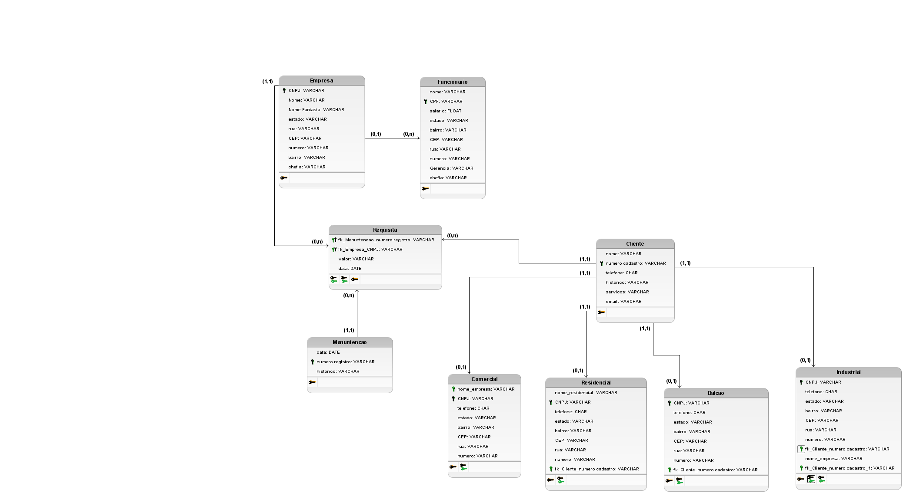

# 🔥 Projeto Banco de Dados - ESM Extintores

Este é um projeto de banco de dados desenvolvido para gerenciar informações de uma empresa de extintores. O sistema foi construído utilizando **Java Spring Boot** e um banco de dados **MySQL**, com procedures, triggers e diversos scripts SQL.

## 🚀 Como rodar o projeto

### 1️⃣ Configure e execute o banco de dados

1. Certifique-se de que o **MySQL Server** está rodando na sua máquina.
2. Abra seu gerenciador de banco de dados (como o **DBeaver**).
3. Na pasta `/SQL` do projeto, execute os scripts na seguinte ordem:

| Ordem | Script                         | Descrição                          |
|-------|---------------------------------|-------------------------------------|
| 1     | `esmextintores(oficial).sql`    | Criação do banco de dados e tabelas|
| 2     | `inserts(oficial).sql`          | Dados iniciais                     |
| 3     | `Trigger(oficial).sql`          | Criação das triggers                |
| 4     | `Procedure(oficial).sql`        | Criação das procedures              |

> ⚠️ **Importante:** O banco de dados deve estar criado e funcionando antes de executar a aplicação Java.

---

### 2️⃣ Clone o repositório

```bash
git clone https://github.com/Art-2005/Projeto-BD.git
cd Projeto-BD
```

---

### 3️⃣ Execute o backend

1. Acesse o arquivo:

```
demo/src/main/java/esmextintores/EsmExtintoresApplication.java
```

2. Clique com o botão direito no arquivo `EsmExtintoresApplication.java` e execute como **Java Application**.

3. Após iniciar, acesse no navegador:

```
http://localhost:8080/
```

> ⚠️ O backend estará rodando localmente na porta 8080.

---

## 🔗 Acesso à aplicação

Após rodar a aplicação Java e configurar o banco, acesse:

```
http://localhost:8080/
```

A interface backend estará funcionando localmente.

---

## 🧠 Tecnologias Utilizadas

- 🐬 **MySQL** — Banco de Dados Relacional
- ☕ **Java** — Linguagem de Programação
- 🌱 **Spring Boot** — Framework Java para aplicações backend
- 🐿️ **DBeaver** — Gerenciador de Banco de Dados

---

## Modelo conceitual

.png>)

## Modelo lógico


